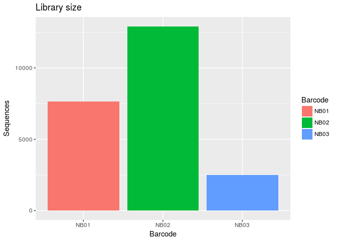

16s Nanopore
================

-   [MinION Sequencing](#minion-sequencing)
-   [Poretools](#poretools)
-   [16S-analysis](#s-analysis)
    -   [Looking at species level](#looking-at-species-level)
-   [References](#references)

Three different environmental samples were sequenced with both MinION and Illumina. For the MinION-sequencing, the complete 16S region was amplified and barcodes were ligated to the different samples. The samples were pooled and run on a single R9 flowcell. The Metrichor Basecalling servie divide the reads into one folder for each barcode that was used. For the Illumina-sequencing the V4 region were amplified using the 5151f/806r primers and sequenced. How does the barcoding work. What methods can be used to analyse complete 16S data from nanopore. Do theese method give similar results to the Illumina data.

### MinION Sequencing

### Poretools

Poretools (Loman and Quinlan 2014) is used to extract the sequence data from the fast5-files. One fastq-file is created for each barcode. Only the 2D sequences are exported and used for downstream analysis. Although only three barcodes have been used, fast5-files have been divided in to more than three folders.

``` bash
for FOLDER in data/pass/*
do
  BARCODE=$( echo $FOLDER | cut -d'/' -f3 )
  poretools fastq --type 2D $FOLDER > ${BARCODE}.fastq
done
```

After the fastqs are created we're doing some very basic QC. First we check the number of reads in each library and the read length distribution of the sequences. Since it is the 16s gene that was sequenced, the anticipated read length should be ~1600bp. AWK is used to generate a csv file containing the read length of all sequences in the fastq-files.

``` bash
for FOLDER in data/pass/*
do
  BARCODE=$( echo $FOLDER | cut -d'/' -f3 )
  cat ${BARCODE}.fastq | awk '{if(NR%4==2){print length($0)}}' > ${BARCODE}.statistics.csv
done
```

We only use the fastqs generated from the barcodes that we have used, i.e. NB01, NB02, and NB03.

``` r
library(reshape)
barcodes <- c("NB01", "NB02", "NB03")
statFiles <- paste0(barcodes, '.statistics.csv')
statData <- lapply(statFiles, read.csv)
names(statData) <- barcodes
statPlot <- melt(statData)
statPlot$variable <- NULL
colnames(statPlot) <- c("ReadLength", "Barcode")
```

Number of reads and sequencing output for each barcode. The number of reads for each library does not reflect the amount of DNA that was loaded. *NB01 (BV85) = 174ng *NB02 (XNy22) = 210ng \*NB03 (XNy50) = 215ng

``` r
library(ggplot2)
ggplot(statPlot, aes(Barcode, fill=Barcode)) + 
  geom_bar(stat = "count") +
  ylab("Sequences") +
  ggtitle("Library size")
```



Next

``` r
ggplot(statPlot, aes(x=ReadLength, fill=Barcode)) +
  geom_histogram(binwidth = 20) +
  xlab("Read Length") +
  ylab("Sequences") +
  ggtitle("Read Length distributions")
```

 All libraries have a peak at 1600bp, which is anticipated since it was the complete 16s gene that was sequenced. There is a similar pattern for all libraries with a tail of shorter sequences.

16S-analysis
------------

Next we want to know from which specie the read originate. Two different methons will be tested, QIIME and Kraken. QIIME is a framework for analysis of 16s data, and Kraken is aimed for analysis of metagenomic shotgun sequencing.
\#\#\# Qiime First step is to prepare the data to be used in qiime. The fastq-files are converted to fasta, and the header for all sequences are changed to contain the sample name and a number. Next all fasta-files are merged to a single file that can be used as input to qiime.

``` bash
for BARCODE in NB01 NB02 NB03
do
  awk 'NR % 4 == 1 {print ">" $0 } NR % 4 == 2 {print $0}' ${BARCODE}.fastq > ${BARCODE}.fasta
  python ren_fasta.py ${BARCODE}.fasta ${BARCODE} ${BARCODE}_ren.fasta
done

cat NB01_ren.fasta NB02_ren.fasta NB03_ren.fasta > NB_ren.fasta
```

When this is done we can start run the closed otu picking pipeline in qiime. The SILVA rRNA-database is used for reference. The pick is done at 80%, 90%, and 97% percentage identity (PID)

``` bash
for PID in 80 90 97
do
pick_closed_reference_otus.py -r /mnt/powervault/moaham/QIIME/SILVA123_QIIME_release/rep_set/rep_set_16S_only/${PID}/${PID}_otus_16S.fasta -p parameter_file_silva_${PID}.txt -t /mnt/powervault/moaham/QIIME/SILVA123_QIIME_release/taxonomy/16S_only/${PID}/taxonomy_all_levels.txt -aO 20 -o Closed_OTU_picking_Nanopore_${PID} -i NB_ren.fasta
summarize_taxa_through_plots.py -i Closed_OTU_picking_Nanopore_${PID}/otu_table.biom -o Closed_OTU_picking_Nanopore_${PID}/taxa_summary
done
```

The same analysis as above was also done using the grenegenes database.

``` bash
# This step was done by Moa
```

The taxa summary for the Phylum order is plotted on the different levels of similarity. 80% and 90%.
**We should also mention how many reads were picked at each level of similarity**

``` r
library(ggplot2)
library(reshape)
otu_table <- read.table("Closed_OTU_picking_Nanopore_80/taxa_summary/otu_table_L2.txt", header=TRUE, sep="\t")
otu_table$OTU.ID <- unlist(lapply(strsplit(as.character(otu_table$OTU.ID), split = "__"), "[", 3))
otu_plot_data <- melt(otu_table, id="OTU.ID")
colnames(otu_plot_data) <- c("Phylum", "Sample", "Abundance")
ggplot(otu_plot_data, aes(x=Sample, y=Abundance, fill=Phylum)) +
  geom_bar(stat = "identity") +
  ggtitle("OTU picking  SILVA 80%")
```

 Note that the order of the bars are inversed.

``` r
otu_table <- read.table("Closed_OTU_picking_Nanopore_90/taxa_summary/otu_table_L2.txt", header=TRUE, sep="\t")
otu_table$OTU.ID <- unlist(lapply(strsplit(as.character(otu_table$OTU.ID), split = "__"), "[", 3))
otu_plot_data <- melt(otu_table, id="OTU.ID")
colnames(otu_plot_data) <- c("Genus", "Sample", "Abundance")
ggplot(otu_plot_data, aes(x=Sample, y=Abundance, fill=Genus)) +
  geom_bar(stat = "identity") +
  ggtitle("OTU picking SILVA 90%")
```

 And GreenGenes at 79%.

``` r
otu_table <- read.table("Closed_OTU_picking_gg_79/Taxa_summary_n2/otu_table_n2_L2.txt", header=TRUE, sep="\t")
otu_table$OTU.ID <- unlist(lapply(strsplit(as.character(otu_table$OTU.ID), split = "__"), "[", 3))
otu_plot_data <- melt(otu_table, id="OTU.ID")
colnames(otu_plot_data) <- c("Genus", "Sample", "Abundance")
otu_plot_data <- otu_plot_data[order(as.character(otu_plot_data$Sample)),]
ggplot(otu_plot_data, aes(x=Sample, y=Abundance, fill=Genus)) +
  geom_bar(stat = "identity") +
  ggtitle("OTU picking GreenGenes 79%")
```

 \#\# Kraken Another approach to sort the reads into phylums is to use kraken. We can run kraken on both the illumina data and the nanopore data to see how similar results the method will give for the two datasets. We start to run kraken on the nanopore reads.

``` bash
for BARCODE in NB01 NB02 NB03
do
kraken --db --threads 20 --fasta-input ${BARCODE}_ren.fasta --output ${BARCODE}.kraken
kraken-report --db ${BARCODE}.kraken > ${BARCODE}.report
awk '$4=="P" {print $0}' ${BARCODE}.report > ${BARCODE}.phylum.report
done
```

Next we run the Illumina data in kraken

``` bash
for BARCODE in 
do
kraken-report --db ${BARCODE}.kraken > ${BARCODE}.report
awk '$4=="P" {print $0}' ${BARCODE}.report > ${BARCODE}.phylum.report
done
```

Finally we can plot the data in R. First we create `get_kraken_table` function to import kraken-reports, we also create a `taxa_plot` function to plot taxa summary for each sample, this will give similar plots as the plots used for the qiime results.

``` r
library(dplyr)

get_kraken_table <- function(x){
  table_path <- x[1]
  sample <- x[2]
  read_filter <- as.numeric(x[3])
  kraken_table <- read.table(table_path, sep = '\t')
  keeps <- c("V2", "V6")
  kraken_table <- kraken_table[keeps]
  colnames(kraken_table) <- c("Abundance", "Taxa")
  print(paste(sample, sum(kraken_table$Abundance)))
  kraken_table$Percentage <- as.numeric(kraken_table$Abundance/sum(kraken_table$Abundance))
  kraken_table <- filter(kraken_table, Percentage > read_filter)
  kraken_table$Sample <- c(sample)
  print(paste(sample, sum(kraken_table$Abundance)))
  kraken_table <- kraken_table[order(kraken_table$Abundance, decreasing = TRUE),]
  
  return(kraken_table)
}

taxa_plot <- function(x){
  kraken_tables <- apply(x, MARGIN = 1, get_kraken_table)
  kraken_table <- do.call("rbind", kraken_tables)
  g <- ggplot(kraken_table, aes(x=Sample, y=Percentage, fill=Taxa)) +
        geom_bar(stat = "identity") +
        ggtitle("Kraken")
  return(g)
}
```

We read the both the reports for the Illumina data and the nanopore data into the same dataframe and plot taxa summaries for each sample.

``` r
m <- matrix(c("NB01_ren.phylum.output", "NB01_BV85.phylum.report", "NB02_ren.phylum.output", "NB02_XNy22.phylum.report", "NB03_ren.phylum.output",  "NB03_XNy50.phylum.report", "NB01_NP", "NB01_Illmn", "NB02_NP", "NB02_Illmn", "NB03_NP", "NB03_Illmn", 0.01, 0.01, 0.01, 0.01, 0.01, 0.01), ncol=3)
taxa_plot(m)
```

    ## [1] "NB01_NP 6331"
    ## [1] "NB01_NP 6207"
    ## [1] "NB01_Illmn 52977"
    ## [1] "NB01_Illmn 52421"
    ## [1] "NB02_NP 10320"
    ## [1] "NB02_NP 10122"
    ## [1] "NB02_Illmn 61852"
    ## [1] "NB02_Illmn 60278"
    ## [1] "NB03_NP 1663"
    ## [1] "NB03_NP 1652"
    ## [1] "NB03_Illmn 20205"
    ## [1] "NB03_Illmn 20056"

 For NB01 and NB02 there is an inrcreased proportion of protobacteria in the nanopore samples. This is not true for the NB03 sample, instead both the Fusobacteria and the Protobacteria are lower abundant. In the text area, we can se how many reads that could be sorted at this order for the different samples. Kraken can assign more reads to a phylum compared to QIIMME.

### Looking at species level

First we extract all speices that has been found in the nanopore and illumina data using kraken

``` bash
for BARCODE in NB01 NB02 NB03 NB01_BV85 NB02_XNy22 NB03_XNy50
do
awk '$4=="S" {print $0}' ${BARCODE}.report > ${BARCODE}.species.report
done
```

Read the kraken reports in to R

``` r
NB01.np = matrix(data=c("NB01_ren.species.output", "NB01_np", 0.001), ncol = 3)
NB01.np.species <- get_kraken_table(NB01.np)
```

    ## [1] "NB01_np 2350"
    ## [1] "NB01_np 2237"

``` r
NB01.illmn = matrix(data=c("NB01_BV85.species.report", "NB01_illmn", 0.001), ncol = 3)
NB01.illmn.species <- get_kraken_table(NB01.illmn)
```

    ## [1] "NB01_illmn 28699"
    ## [1] "NB01_illmn 27555"

``` r
NB02.np = matrix(data=c("NB02_ren.species.output", "NB02_np", 0.001), ncol = 3)
NB02.np.species <- get_kraken_table(NB02.np)
```

    ## [1] "NB02_np 3725"
    ## [1] "NB02_np 3425"

``` r
NB02.illmn = matrix(data=c("NB02_XNy22.species.report", "NB02_illmn", 0.001), ncol = 3)
NB02.illmn.species <- get_kraken_table(NB02.illmn)
```

    ## [1] "NB02_illmn 29580"
    ## [1] "NB02_illmn 27290"

Can we find an addition of species in NB02, compared to NB02

``` r
differential_species <- as.data.frame(setdiff(NB01.np.species$Taxa, NB02.np.species$Taxa))
colnames(differential_species) <- c("Taxa")
NB01.np.diff <- inner_join(NB01.np.species, differential_species)
print(NB02.np.diff)
```

    ##    Abundance                                                     Taxa
    ## 1         16                                    Amphibacillus xylanus
    ## 2         15                            Gallionella capsiferriformans
    ## 3         12                           Candidatus Babela massiliensis
    ## 4         11                                     Leptothrix cholodnii
    ## 5         11                                        Coxiella burnetii
    ## 6         11                                   Wolinella succinogenes
    ## 7          8                                    Sphingobium sp. SYK-6
    ## 8          8                                 Flavobacterium columnare
    ## 9          8                                          Opitutus terrae
    ## 10         7                                   Rubrivivax gelatinosus
    ## 11         7                          Novosphingobium aromaticivorans
    ## 12         7                                      Acholeplasma palmae
    ## 13         6                                      Pandoraea sp. RB-44
    ## 14         6                                  Rhodobacter sphaeroides
    ## 15         6                                    Sanguibacter keddieii
    ## 16         5                           Candidatus Profftella armatura
    ## 17         5                                    Dichelobacter nodosus
    ## 18         5                                        Geobacter lovleyi
    ## 19         5                                   Sinorhizobium meliloti
    ## 20         5                                           Leifsonia xyli
    ## 21         5                                    Thermobispora bispora
    ## 22         5                     uncultured Termite group 1 bacterium
    ## 23         4               Candidatus Kinetoplastibacterium crithidii
    ## 24         4                            Halothiobacillus neapolitanus
    ## 25         4                                  Acinetobacter baumannii
    ## 26         4                               Bdellovibrio bacteriovorus
    ## 27         4                                    Bdellovibrio exovorus
    ## 28         4                                Asticcacaulis excentricus
    ## 29         4                                      Fibrella aestuarina
    ## 30         4                              Haliscomenobacter hydrossis
    ## 31         4                                        Bacillus subtilis
    ## 32         4                                Planctomyces brasiliensis
    ## 33         4                                        Pirellula staleyi
    ##     Percentage  Sample
    ## 1  0.004295302 NB02_np
    ## 2  0.004026846 NB02_np
    ## 3  0.003221477 NB02_np
    ## 4  0.002953020 NB02_np
    ## 5  0.002953020 NB02_np
    ## 6  0.002953020 NB02_np
    ## 7  0.002147651 NB02_np
    ## 8  0.002147651 NB02_np
    ## 9  0.002147651 NB02_np
    ## 10 0.001879195 NB02_np
    ## 11 0.001879195 NB02_np
    ## 12 0.001879195 NB02_np
    ## 13 0.001610738 NB02_np
    ## 14 0.001610738 NB02_np
    ## 15 0.001610738 NB02_np
    ## 16 0.001342282 NB02_np
    ## 17 0.001342282 NB02_np
    ## 18 0.001342282 NB02_np
    ## 19 0.001342282 NB02_np
    ## 20 0.001342282 NB02_np
    ## 21 0.001342282 NB02_np
    ## 22 0.001342282 NB02_np
    ## 23 0.001073826 NB02_np
    ## 24 0.001073826 NB02_np
    ## 25 0.001073826 NB02_np
    ## 26 0.001073826 NB02_np
    ## 27 0.001073826 NB02_np
    ## 28 0.001073826 NB02_np
    ## 29 0.001073826 NB02_np
    ## 30 0.001073826 NB02_np
    ## 31 0.001073826 NB02_np
    ## 32 0.001073826 NB02_np
    ## 33 0.001073826 NB02_np

References
==========

Loman, N., and A. Quinlan. 2014. “Poretools: a toolkit for analyzing nanopore sequence data.” Cold Spring Harbor Labs Journals. doi:[10.1101/007401](https://doi.org/10.1101/007401).
